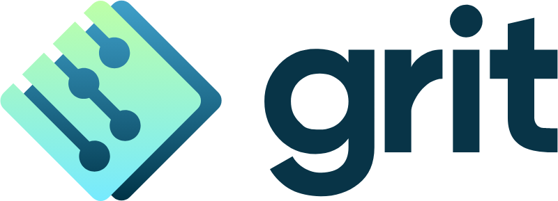
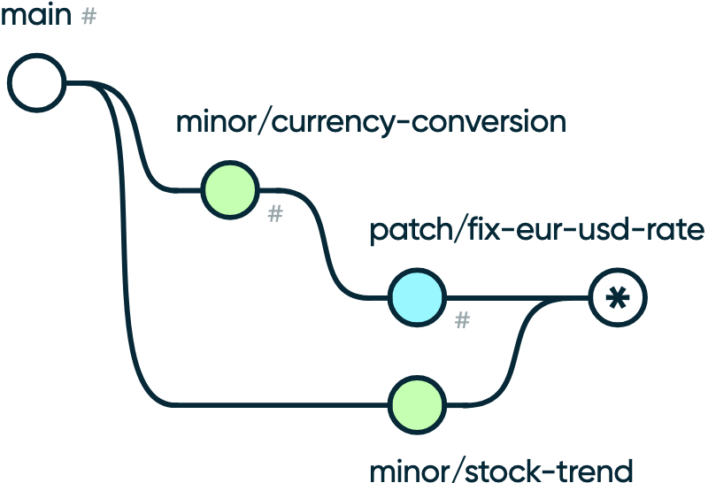

<a href="https://github.com/t-ski/grit">
  
</a><br><br>

Intuitive [Semver](https://semver.org) based git client abstraction.

# grit

## Installation

> 🔶 &hairsp; grit is a [git](https://git-scm.com/) abstraction. Thus, it requires a git installation. The git binary needs to be accessible in path.

> 🖥️ &hairsp; grit does currently support macOS host systems.

``` console
bash <(curl -s https://raw.githubusercontent.com/t-ski/grit/main/installer/install.mac.sh) 0.1.0
```
> 💡 &hairsp; The grit version to install must be specified through the trailing argument ([browse versions](https://github.com/t-ski/grit/releases)).

## Usage Synopsis

grit purposefully integrates with the Semver approach. The grit command line interface is accordingly designed. The atomic grit workflow is a development that is either a patch, minor, or major increment (see Semver). The fundamental design principle for grit is locality. This means, the HEAD is always on a branch linked with a Semver development declaration (such as a patch).

```
grit <command> [<arg:positional>]* [--<arg:key>|-<arg:shorthand> *?]*
```

<a href="https://github.com/t-ski/grit#usage-synopsis">
  
</a><br><br>

> 💡 &hairsp; Run `grit help` to view usage instructions in the console.

## Start Development

An incremental development can be started with the respective Semver terminology. it is recommended to provide the declared development in a few dash-separated words to the name option. Alternatively, the current timestamp is used to identify the underlying git branch chronologically.

### Patch

``` console
grit patch [--name|-name *]?
```

### Minor

``` console
grit minor [--name|-name *]?
```

### Major

``` console
grit major [--name|-name *]?
```

#### Example

``` console
grit patch fix-typo
```

## Complete Development

Completing a previously started incremental development includes to a few steps: The development branch is merged to the main branch (or a differently specified target). Unless explicitly flagged to keep existing, the development branch is subsequently deleted. Finally, a new git tag is created that is annotated with the next according Semver version (`v<major>.<minor>.<patch>`).

``` console
grit complete [--target|-t *]? [--keep-branch]? 
```

> 💡 &hairsp; Based on the generated tag, CI pipelines can easily infer releases.

## Redeclare Development

A development might deviate from the original declared purpose. For instance, when a patch introduces an additional feature. Instead of inverting the branching behaviour, grit provides a Semver purpose redeclaration command.

``` console
grit redeclare [patch|minor|major]
```

## Abort Development

Aborting a development helps with discontinued developments. This is, the HEAD is reset to the tip of the main branch. The stale development branch irrevocably deleted.

``` console
grit abort
```

> 💡 &hairsp; Based on the generated tag, CI pipelines can easily infere potential releases.

## Status

As with git, overall status information can be displayed with the status utility command.

``` console
grit status
```

##

<sub>&copy; Thassilo Martin Schiepanski</sub>
